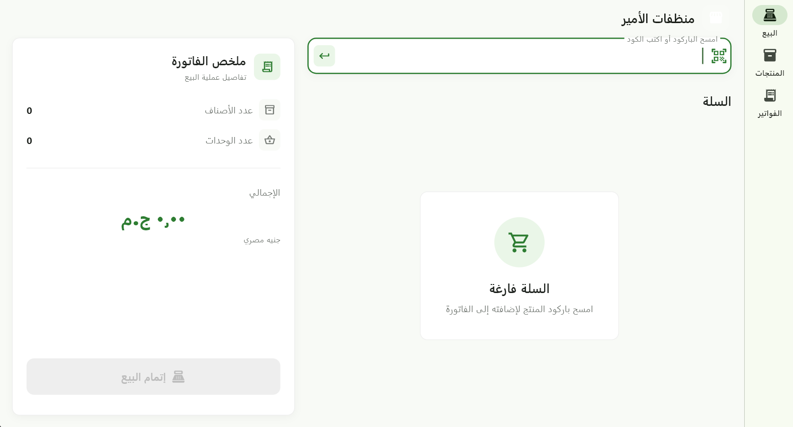
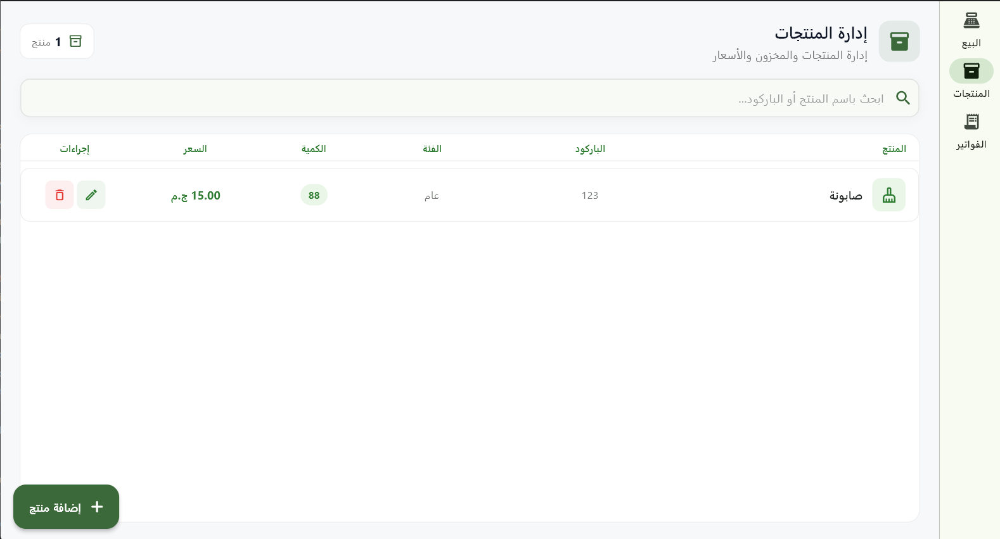
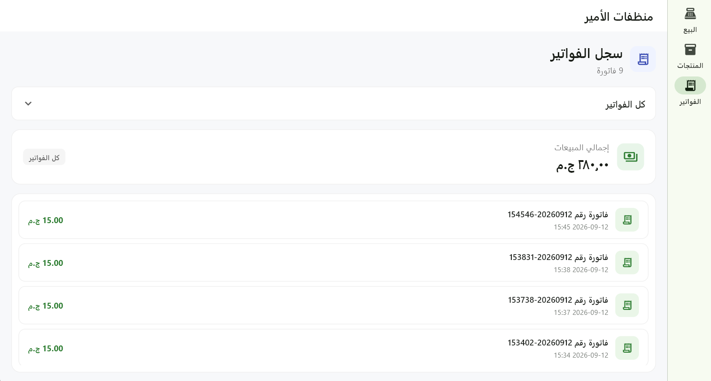
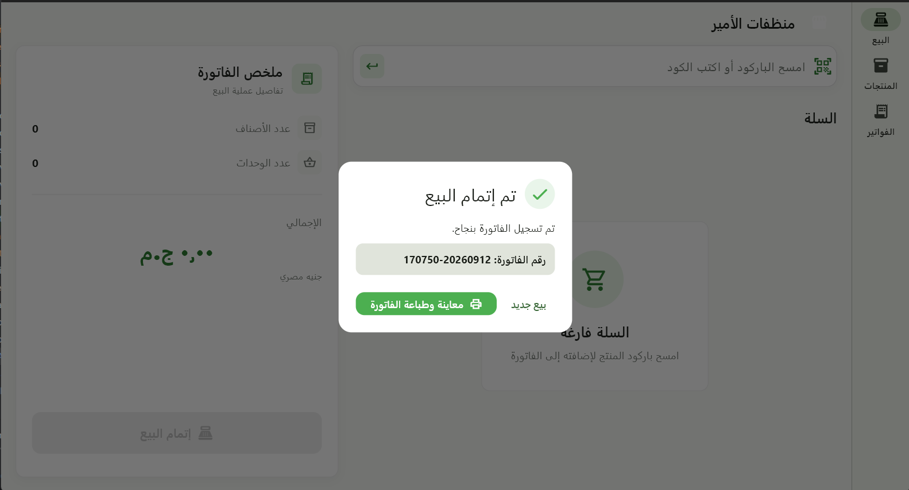

# Cleaning POS

A desktop Point of Sale (POS) application built with **Flutter** for managing products, sales, invoices, and inventory in a cleaning-products store.

The application is designed with a clean and maintainable architecture to make future updates and feature additions easier without tightly coupling the UI to business logic or data sources.

## Features

* Product management — Add, edit, delete, and search products.
* Barcode-based product lookup.
* Shopping cart and checkout.
* Invoice creation and invoice history.
* Daily sales summary.
* Detailed invoice viewing.
* PDF invoice generation.
* Printing service integration.
* Local data persistence using SQLite.
* Arabic RTL user interface.
* Input validation and error handling.
* Unit tests for validation logic.

## Tech Stack

* **Flutter**
* **Dart**
* **MVVM Architecture**
* **Provider**
* **SQLite**
* **Repository Pattern**
* **PDF Generation**
* **Windows Desktop**
* **Git & GitHub**

## Architecture

The project follows the **MVVM (Model–View–ViewModel)** architecture with a separate Repository layer.

```text
lib/
├── core/
│   ├── theme/
│   ├── constants/
│   └── utils/
│
├── data/
│   ├── models/
│   ├── database/
│   └── repositories/
│
├── viewmodels/
│
└── views/
    ├── shared/
    ├── pos/
    ├── products/
    └── invoices/
```

### Model

The `data/` layer contains:

* Data models
* SQLite database operations
* Repository classes

### ViewModel

The `viewmodels/` layer contains the application's state and business logic.

Each ViewModel extends `ChangeNotifier` and communicates with the Repository layer instead of accessing the database directly.

### View

The `views/` layer contains the UI components and screens.

The UI is separated from business logic, making the screens easier to maintain and modify.

### Repository Layer

Repositories act as an abstraction between the ViewModels and the data source.

```text
View
  ↓
ViewModel
  ↓
Repository
  ↓
SQLite Database
```

This makes it easier to replace or extend the data source in the future, such as adding cloud synchronization.

## Project Structure

```text
lib/
├── main.dart
│
├── core/
│   ├── theme/
│   │   ├── app_colors.dart
│   │   ├── app_text_styles.dart
│   │   └── app_theme.dart
│   │
│   ├── constants/
│   │   └── app_dimensions.dart
│   │
│   └── utils/
│       ├── result.dart
│       └── validators.dart
│
├── data/
│   ├── models/
│   │   ├── product.dart
│   │   └── invoice.dart
│   │
│   ├── database/
│   │   └── database_helper.dart
│   │
│   └── repositories/
│       ├── product_repository.dart
│       └── invoice_repository.dart
│
├── viewmodels/
│   ├── pos_view_model.dart
│   ├── products_view_model.dart
│   └── invoices_view_model.dart
│
└── views/
    ├── shared/
    ├── pos/
    ├── products/
    └── invoices/
```

## Error Handling

The project uses a custom `Result<T>` type to represent successful and failed operations.

```text
Success<T>
Failure<T>
```

This provides a consistent way to handle errors between the Repository and ViewModel layers without placing database logic inside the UI.

## Validation

Form validation is centralized inside:

```text
core/utils/validators.dart
```

This keeps validation rules reusable and makes future changes easier to maintain.

## Dependency Injection

The application uses **Provider** for dependency injection and state management.

Repositories are initialized in `main.dart` and injected into the corresponding ViewModels using `MultiProvider`.

This keeps dependencies centralized and prevents Views from creating database or repository instances directly.

## Testing

Unit tests are included for the application's validation logic.

Run the tests using:

```bash
flutter test
```

## Getting Started

### Prerequisites

Make sure you have:

* Flutter SDK installed
* Dart SDK
* Windows desktop support enabled

### Installation

Clone the repository:

```bash
git clone https://github.com/Youssef-Mamdouh-ali/cleaning_pos.git
```

Navigate to the project:

```bash
cd cleaning_pos
```

Install dependencies:

```bash
flutter pub get
```

Run the application on Windows:

```bash
flutter run -d windows
```

## Future Improvements

* Cloud database synchronization.
* Backup and restore functionality.
* Advanced sales reports.
* User authentication and roles.
* Improved printer management.
* Online/offline synchronization.


## Screenshots

### Home Screen


### Products Management


### Invoices


### Printing


## Author

**Youssef Mamdouh Ali**

Flutter Developer

**GitHub:**
https://github.com/Youssef-Mamdouh-ali
